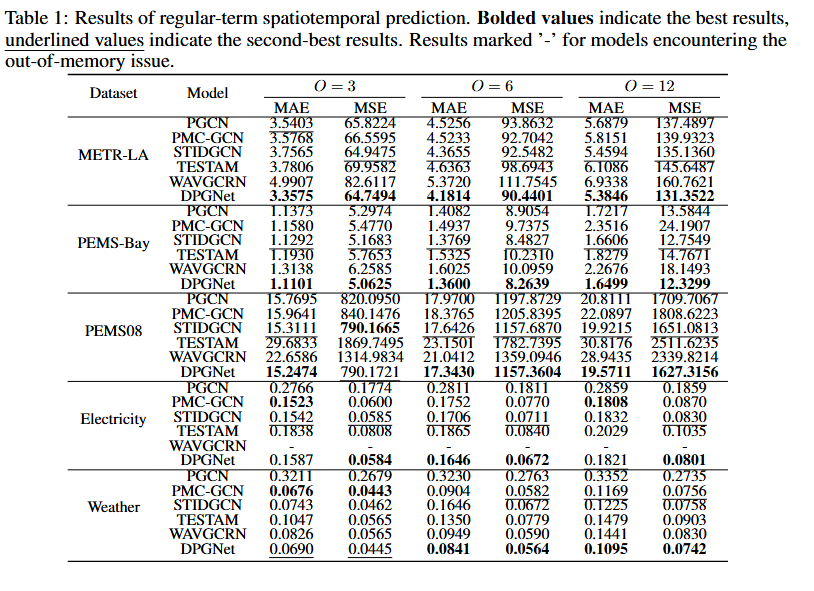

# DPGNet

A pytorch implementation for the paper 'DPGNet: A Dynamic Graph Prediction Network for Spatiotemporal Forecasting'. 

# 🎯Overview

Figure1.The overall architecture of the proposed DPGNet

# 📊Regular Prediction

Figure2.Regulat Prediction results. For METR-LA, PEMS08, and PEMS-Bay, we set the input length $L$ to 12, with prediction lengths $O$ of 3, 6, and 12, corresponding to time horizons of 15, 30, and 60 minutes, respectively. For the Electricity and Weather datasets, we set $L$ to 168, with prediction lengths $O$ of 3, 6, and 12. For Weather, these correspond to 30, 60, and 120 minutes, while for Electricity, they represent 3, 6, and 12 hours.

# 📊Long-Term Prediction


# 📊Adaptive Graph Learner replacement experiments


# 📝Install dependecies

Install the required packages with following code.

```pip install -r requirements.txt```

# 📚Data Preparation


# 🚀Run Experiment

We have provided all the experimental scripts for the benchmarks in the `./scripts folder`, which cover all the benchmarking experiments. To reproduce the results, you can run the following shell code.

``` ./scripts/train.sh```