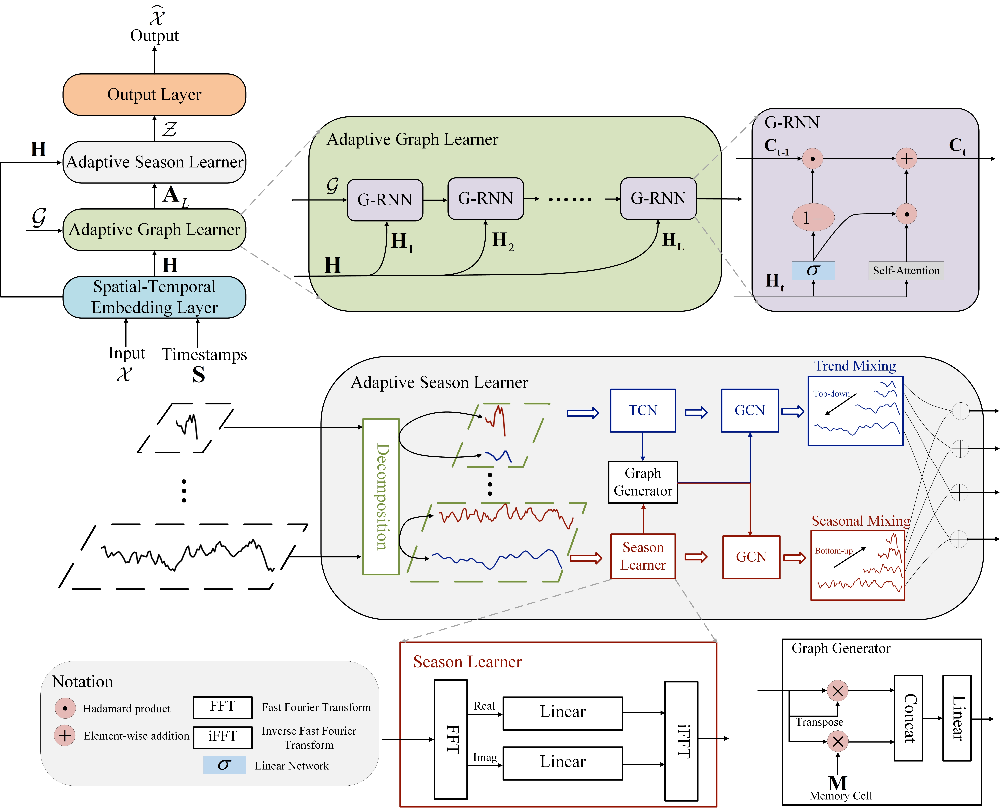

# DPGNet

A pytorch implementation for the paper 'DPGNet: A Dynamic Graph Prediction Network for Spatiotemporal Forecasting'. 

# 🎯Overview

Figure1.The overall architecture of the proposed STD2Vformer

# 📊Regular Prediction


# 📊Long-Term Prediction


# 📊Adaptive Graph Learner replacement experiments


# 📝Install dependecies

Install the required packages

```pip install -r requirements.txt```

# 📚Data Preparation


# 🚀Run Experiment

We have provided all the experimental scripts for the benchmarks in the `./scripts folder`, which cover all the benchmarking experiments. To reproduce the results, you can run the following shell code.

```   ./scripts/train.sh```